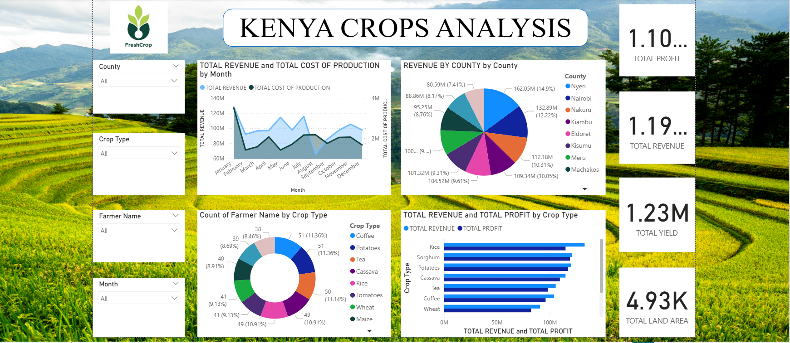

# Kenya Crops Analysis Dashboard (Power BI)

This Power BI dashboard provides a comprehensive analysis of agricultural production in Kenya. It visualizes crop performance, revenue, profit, farmer distribution, and land usage across different counties and crop types.

---

## Project Goals

- Provide a data-driven overview of crop performance across Kenya.
- Help stakeholders (farmers, researchers, NGOs, and policymakers) identify high-revenue crops and optimize farming strategies.
- Encourage transparency and collaboration in agricultural planning using real-world data visualization.

---

##The data includes:
- Crop type
- County
- Farmer name
- Yield
- Revenue and production cost
- Land area

---

## Key Insights

- **Rice** is the most profitable crop across the dataset.
- **Nyeri County** leads in total revenue contribution (~15%).
- Production cost remains stable throughout the year, while revenue fluctuates — especially peaking in January.
- Farmers are fairly distributed across major crops like Potatoes, Coffee, and Tea.
- The dashboard allows filtering by county, crop type, farmer, and month.

---

##  How to Open and Use This File

### Requirements:
- [Power BI Desktop (Free)](https://powerbi.microsoft.com/en-us/desktop/)

### Steps:
1. Download and install Power BI Desktop.
2. Clone or download this repository.
3. Open the file named `Kenya_Crops_Analysis.pbix` in Power BI Desktop.
4. Explore the interactive visuals and use the filters to dive into specific counties, crops, or months.

---

## Preview

 <!-- #  Kenya Crops Analysis Dashboard (Power BI)

This Power BI dashboard provides a comprehensive analysis of agricultural production in Kenya. It visualizes crop performance, revenue, profit, farmer distribution, and land usage across different counties and crop types.

---

## Project Goals

- Provide a data-driven overview of crop performance across Kenya.
- Help stakeholders (farmers, researchers, NGOs, and policymakers) identify high-revenue crops and optimize farming strategies.
- Encourage transparency and collaboration in agricultural planning using real-world data visualization.

---

## 📊 Data Sources

> ⚠️ **Note:** The original dataset is not included in this repository for privacy/compliance reasons. You can request access or replace with open-source agricultural data for practice purposes.

The data includes:
- Crop type
- County
- Farmer name
- Yield
- Revenue and production cost
- Land area

---

## 📌 Key Insights

- **Rice** is the most profitable crop across the dataset.
- **Nyeri County** leads in total revenue contribution (~15%).
- Production cost remains stable throughout the year, while revenue fluctuates — especially peaking in January.
- Farmers are fairly distributed across major crops like Potatoes, Coffee, and Tea.
- The dashboard allows filtering by county, crop type, farmer, and month.

---

## How to Open and Use This File

### Requirements:
- [Power BI Desktop (Free)](https://powerbi.microsoft.com/en-us/desktop/)

### Steps:
1. Download and install Power BI Desktop.
2. Clone or download this repository.
3. Open the file named `Kenya_Crops_Analysis.pbix` in Power BI Desktop.
4. Explore the interactive visuals and use the filters to dive into specific counties, crops, or months.

---

## Preview

 <!-- #  Kenya Crops Analysis Dashboard (Power BI)

This Power BI dashboard provides a comprehensive analysis of agricultural production in Kenya. It visualizes crop performance, revenue, profit, farmer distribution, and land usage across different counties and crop types.

---

## Project Goals

- Provide a data-driven overview of crop performance across Kenya.
- Help stakeholders (farmers, researchers, NGOs, and policymakers) identify high-revenue crops and optimize farming strategies.
- Encourage transparency and collaboration in agricultural planning using real-world data visualization.

---

##The data includes:
- Crop type
- County
- Farmer name
- Yield
- Revenue and production cost
- Land area

---

## Key Insights

- **Rice** is the most profitable crop across the dataset.
- **Nyeri County** leads in total revenue contribution (~15%).
- Production cost remains stable throughout the year, while revenue fluctuates — especially peaking in January.
- Farmers are fairly distributed across major crops like Potatoes, Coffee, and Tea.
- The dashboard allows filtering by county, crop type, farmer, and month.

---

## How to Open and Use This File

### Requirements:
- [Power BI Desktop (Free)](https://powerbi.microsoft.com/en-us/desktop/)

### Steps:
1. Download and install Power BI Desktop.
2. Clone or download this repository.
3. Open the file named `Kenya_Crops_Analysis.pbix` in Power BI Desktop.
4. Explore the interactive visuals and use the filters to dive into specific counties, crops, or months.

---

## Preview

---

## Future Improvements

- Add predictive analytics for crop yield.
- Integrate real-time data sources (e.g., weather APIs).
- Embed geospatial crop maps using Power BI maps.

---

## Contact

If you'd like to collaborate, get access to the raw dataset, or suggest improvements, feel free to open an issue or reach out via [GitHub Discussions](https://github.com/Njeri-Kimaru/KENYA-CROPS-ANALYSIS-DASHBOARD/new/main).

---

## 🏷️ Tags

`Power BI` `Data Visualization` `Kenya` `Agriculture` `Dashboard` `Business Intelligence` `Farming Analytics`

 -->

